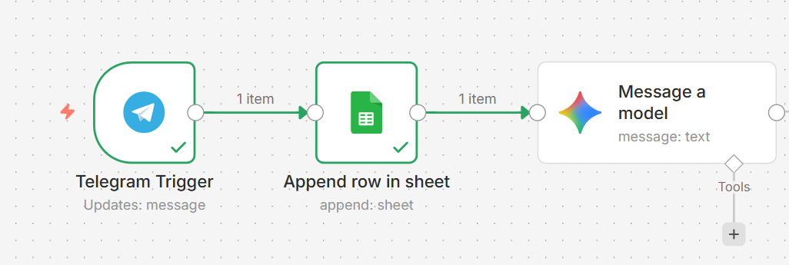

# Telegram AI Automation Bot

## 📌 Descripción

Este proyecto es un flujo de automatización creado con **n8n** que:

- Recibe mensajes desde un bot de Telegram  
- Guarda los mensajes en Google Sheets  
- Envía el contenido a Google Gemini (IA) para su procesamiento  

El objetivo es demostrar la integración de APIs, automatización de flujos y uso de inteligencia artificial en un entorno real.

---

## 🛠 Tecnologías utilizadas

- Telegram Bot API  
- n8n  
- Google Sheets API  
- Google Gemini (PaLM API)  
- Git & GitHub  

---

## ⚙️ Estructura del flujo

1. **Telegram Trigger** → Captura los mensajes entrantes  
2. **Google Sheets** → Registra fecha, nombre y mensaje  
3. **Gemini AI** → Procesa el mensaje mediante inteligencia artificial  

---

## 📸 Captura del flujo

---

## 🚀 Posibles aplicaciones

Esta automatización puede utilizarse para:

- Captura automática de leads  
- Registro de conversaciones  
- Procesamiento de mensajes con IA  
- Automatización de atención al cliente  
- Integración con sistemas CRM  

---

## 👨‍💻 Autor

Fernando Villarroel
